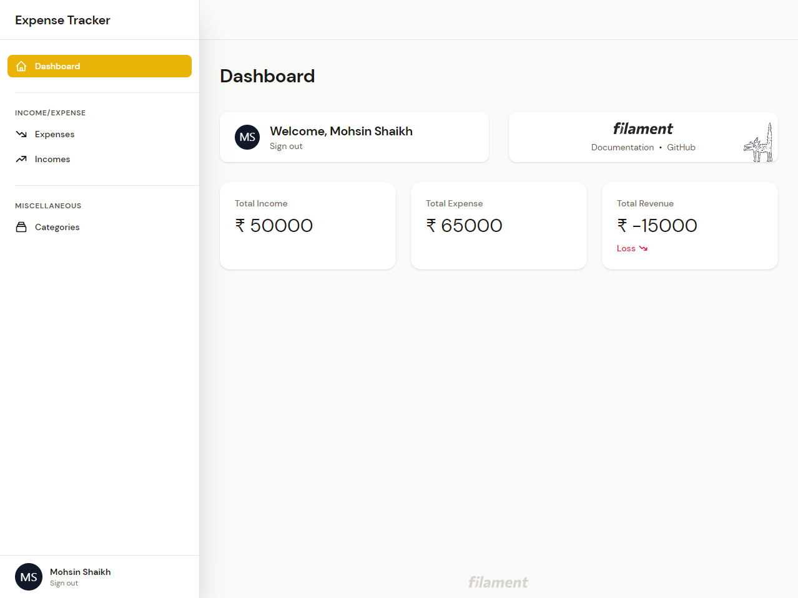

# Expense Tracker

> This is a simple Expense Tracker app build with [Filament Admin](https://github.com/laravel-filament/filament) ([TALL Stack](https://tallstack.dev/)).



## Demo hosted on Heroku

[Demo Filament Expense Tracker](http://filament-expense-tracker.herokuapp.com)

## Features

- Income
- Expenses
- Category
- Dashboard
- Profile
- StatOverview Widget
- Recent Activity Widget
- Register (Livewire Component)

## Upcoming Features

- Landing Page
- Setup Default Categories for new users
- Report (Monthly, Yearly, Custom)
- Import/Export CSV

## Installation

Clone the repo locally:

```sh
git clone https://github.com/mohsin-shaikh/expense-tracker.git expense_tracker
cd expense_tracker
```

Install PHP dependencies:

```sh
composer install
```

Setup configuration:

```sh
cp .env.example .env
```

Generate application key:

```sh
php artisan key:generate
```

Edit .env and set your database connection details.

```sh
DB_CONNECTION=mysql
DB_HOST=127.0.0.1
DB_PORT=3306
DB_DATABASE=expense_tracker
DB_USERNAME=root
DB_PASSWORD=
```

Run database migrations:

```sh
php artisan migrate
```

Run database seeder:

```sh
php artisan db:seed
```

Run the dev server (the output will give the address):

```sh
php artisan serve
```

You're ready to go! Visit Expense Tracker in your browser, and login with:

- **Username:** admin@gmail.com
- **Password:** password

## Special Thanks

- [Dan Harrin](https://github.com/danharrin)
- [Shuvro Roy](https://github.com/shuvroroy)

## License

The Expense Tracker is open-sourced software licensed under the [MIT license](https://opensource.org/licenses/MIT).
